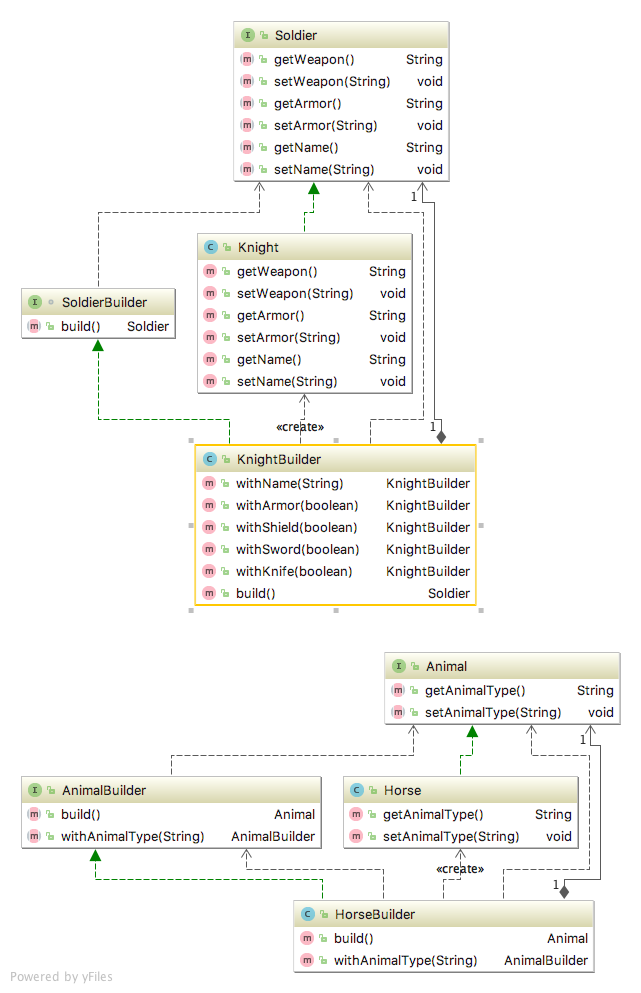

## Builder pattern
    * Creational

## Intent
Separate the construction of a complex object from its representation so that the same construction process can create 
different representations.

## Applicability
Use the Builder pattern when

* the algorithm for creating a complex object should be independent of the parts that make up the object and how they're assembled
* the construction process must allow different representations for the object that's constructed

## Real world examples

* [java.lang.StringBuilder](http://docs.oracle.com/javase/8/docs/api/java/lang/StringBuilder.html)
* [java.nio.ByteBuffer](http://docs.oracle.com/javase/8/docs/api/java/nio/ByteBuffer.html#put-byte-) as well as similar buffers such as FloatBuffer, IntBuffer and so on.
* [java.lang.StringBuffer](http://docs.oracle.com/javase/8/docs/api/java/lang/StringBuffer.html#append-boolean-)
* All implementations of [java.lang.Appendable](http://docs.oracle.com/javase/8/docs/api/java/lang/Appendable.html)
* [Apache Camel builders](https://github.com/apache/camel/tree/0e195428ee04531be27a0b659005e3aa8d159d23/camel-core/src/main/java/org/apache/camel/builder)

## Reference
[Design Patterns: Elements of Reusable Object-Oriented Software by Erich Gamma, Richard Helm, Ralph Johnson and John 
Vlissides.](https://www.amazon.com/Design-Patterns-Elements-Reusable-Object-Oriented/dp/0201633612/)